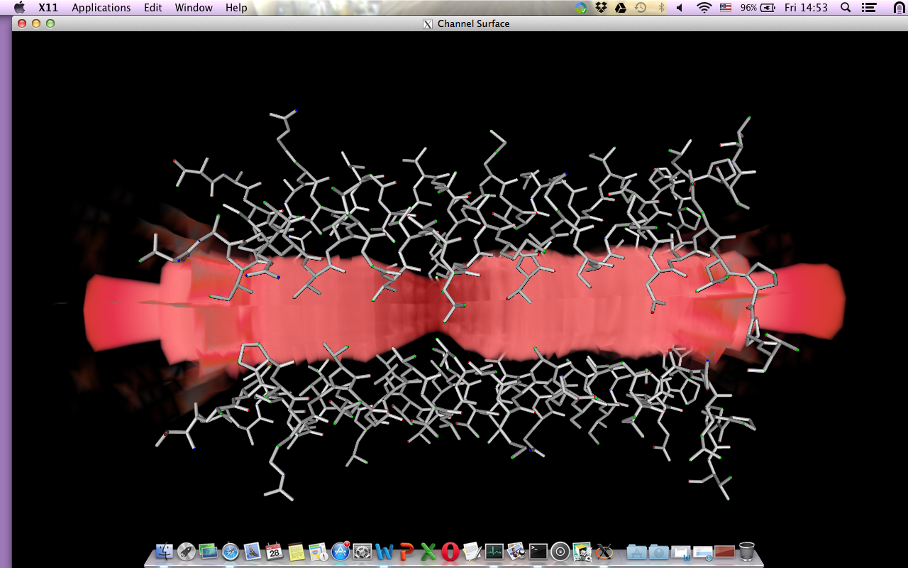

.. _vtkPore:

vtkPore Application
====================

The purpose of this application is to create series of images to quickly visualise the pore radius with it's surrounding residues.

*   The current version reads only one pdb file, named TM2.pdb
*   You'll need python 2.7 and vtk to run the program.

